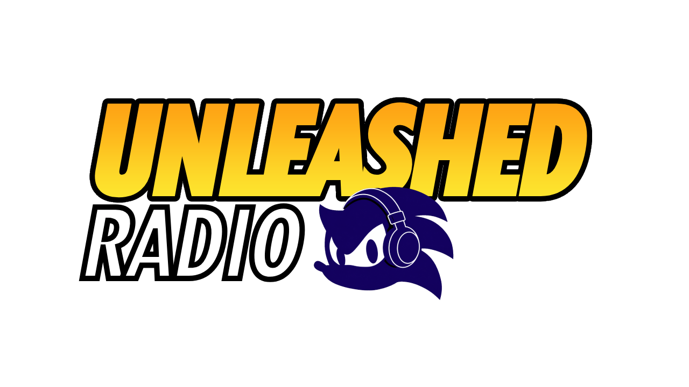

# Sobre este site
Este é um site simples de páginas encadeadas: cada página tem uma imagem de
fundo, uma música de fundo, e botões (também em forma de imagem) que levam a
outras páginas.
O intuito deste projeto é que seja algo interativo como um "rádio" online, mas 
ao mesmo tempo, como um universo virtual ambientado no mundo de Sonic Unleashed
para que você possa visitar os países e apenas relaxar com as músicas de cada
lugar.

## Como funciona?
Ao acessar o site você será recebido por botões flutuantes, cada um representando
o país específico do jogo. Você notará também que existe um marcador no canto superior
direito indicando quantas pessoas estão online naquele contexto, isso significa que
se você estiver em Apotos no cenário diurno, e o marcador indicar o número 5, existirão
4 pessoas além de você no mesmo lugar relaxando com aquela música.

## Isso é oficial? É um projeto da SEGA?
Obviamente *NÃO*. A SEGA não tem o costume de mencionar ou lembrar que 
esse jogo existe, devido a polêmicas na época em que ele foi lançado.
No entanto, ainda que ela o fizesse, dificilmente faria um site com 
o foco exclusivo em apenas ouvir músicas do jogo.
Este é um site puramente feito por um fã, para outros fãs, e não tem 
o intuito de roubar, difamar, abusar ou lucrar com a marca Sonic 
The Hedgehog, ou qualquer outro termo relacionado.
Apoiem o trabalho oficial da SEGA comprando jogos do ouriço e de 
suas franquias derivadas sempre que possível, ou escutando as músicas
oficiais dos jogos no Spotify e YouTube.

## O que esperar para o futuro do site?
Honestamente eu não sei ainda, tenho muitas ideias de funções que podem
vir, talvez uma galeria com artes oficiais do jogo, ou até cutscenes e 
cenas especiais poderiam ser adicionadas futuramente.

## Haverá algum tipo de chat online?
Definitivamente não. Já pensei em adicionar isso, porém a internet moderna
me faz questionar essa ideia em todos os sentidos. Um chat 100% aberto
teria margem para coisas inimagináveis: poderia haver pessoas boas conversando
sobre o quanto gostam do jogo, mas poderia também haver pessoas mal-intencionadas
fazendo coisas que prefiro nem imaginar. Talvez um sistema de mensagens prontas
seja incluído no futuro, com frases como "gosto desse lugar" e "este é meu país
preferido".

## Como funciona o sistema "Online" do site? 

Toda vez que um usuário entra no site, após 20 segundos, ele envia um sinal ao CloudFlare indicando que ele está no site, e isso faz o contador adicionar um número a mais no contador.
Da mesma forma, quando você sair da página, ele vai demorar cerca de 20 a 40 segundos para remover esse número que indicaria a sua presença ouvindo aquela música. 
Não é muito diferente dos sistemas online atuais, como em lives do YouTube, por exemplo. 

## Você usou IA em alguma parte desse projeto?

Sim, infelizmente para alguns e felizmente para outros. Sendo sincero eu não sou um expert em programação, nunca tinha desenvolvido um projeto como esse antes então o Claude foi uma ferramenta de grande ajuda na construção deste site e implementação de varias funções. Além disso, utilizei o ChatGPT para melhorar a qualidade de ícones e outros aspectos pequenos que ao serem extraidos do jogo não tinham uma qualidade boa o suficiente para serem incluidas no site. Como exemplo posso mencionar os ícones da Biblioteca de Spagonia que foram retirados da Versão de Nintendo Wii, mas ao invés de fazer um RIP direto do jogo eu usei capturas de tela e solicitei uma reconstrução do asset para o ChatGPT. Aqui deixarei um exemplo de a imagem original do jogo, em comparação com a versão "remasterizada" que o GPT criou:

Outro detalhe que muitos vão notar é a Biblioteca/Laboratório do Professor Pickle, o fundo foi completamente remasterizado e foi adicionado uma TV e um tocador de Vinil que aparecem no jogo original, com o auxilio do GPT. 

Em resumo, o Claude me ajudou na programação e o GPT foi usado para aumentar a qualidade de imagens. Não quero que esse site pareça um "AI Slop" então, não se preocupem, estou tomando cuidado para não abusar da ferramenta ou colocar coisas sem alma e gênericas no site.

## Agradecimentos especiais e créditos

A imagem de fundo do planeta terra de Sonic Unleashed foi rippada e postada na internet por: [Sonic Konga](https://www.deviantart.com/sonic-konga/art/World-Map-Sonic-Unleashed-854480210)

As bandeiras dos paises em HD, usadas na página principal, foram feitas por: [Piexter](https://www.reddit.com/r/SonicTheHedgehog/comments/sxwtgy/recreated_flags_from_sonic_unleashed/?solution=bc75a621bce368f3bc75a621bce368f3&js_challenge=1&token=7afd7253fec22262ff1c52b1703fe9ec3618cdffb27128858707b972042cbb37&jsc_orig_r=)

O ícone de medalha de sol e lua no canto superior direito foi criada por: [boilingpot](https://www.spriters-resource.com/playstation_2/sonicunleashed/asset/122017/)

As Cutcenes desse projeto, presentes no laboratório do professor pickle, foram ripadas e postadas na internet por [SEGA & Matthew Poulin](https://archive.org/details/sonic-unleashed-english-cutscenes), então os créditos por esse trabalho ficam reservados ao mesmo.
